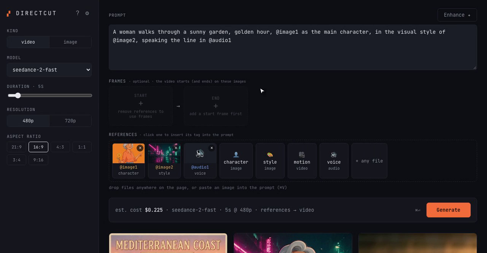
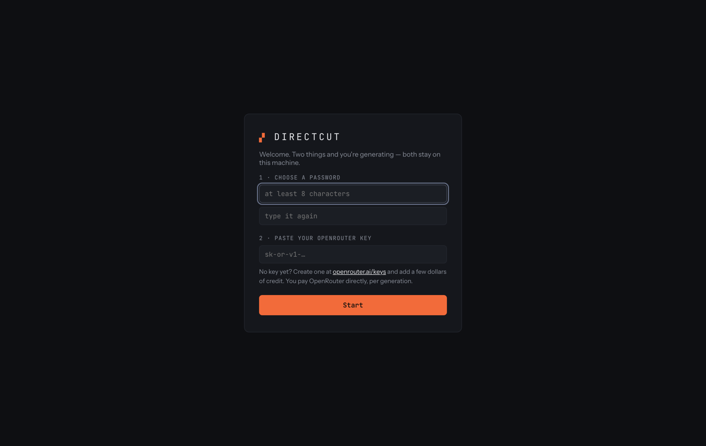

# Directcut

**Generate AI video and images on your own computer, and pay the model price, not a platform's markup.**

Directcut is a small app you run yourself. It gives you a clean browser UI for
ByteDance's **Seedance 2.5** (video) and **Seedream 5** (image) models through
[OpenRouter](https://openrouter.ai). You bring your own OpenRouter key and pay
per generation. There's no subscription, no credits system and no middleman,
and every file you make is saved to your own disk.

Open source (MIT), by [Switch Case Studio](https://switchcasestudio.com).



▶ **[Watch the 90-second how-to video](docs/media/directcut-demo.mp4)**: the built-in tour, building a shot with character / style / voice references, and generating an image. New here? Click **?** next to ⚙ in the app to replay the tour anytime.

## Why

Generation platforms resell these same models behind monthly plans and credit
packs. Directcut calls them directly, so you see the real price before you
click **Generate**:

| What | Estimated cost |
|---|---|
| 5s video, 480p, `seedance-2.5` | ~$0.55 |
| 5s video, 720p, `seedance-2.5` | ~$1.20 |
| 5s video, 480p, `seedance-2-fast` | ~$0.23 |
| 1K image, `seedream-5-pro` | ~$0.045 |
| 2K image, `seedream-5-lite` | ~$0.035 |

Estimates are deliberately on the high side. When OpenRouter reports the
actual charge, Directcut records that instead. A **daily spend cap** (default
$10) stops a typo or a runaway script from draining your balance.

## Get started (about 5 minutes)

You need two things:

1. **Node.js 22 or newer.** Download the LTS installer from
   [nodejs.org](https://nodejs.org) and click through it.
2. **An OpenRouter key.** Sign up at [openrouter.ai](https://openrouter.ai),
   add a few dollars of credit, and create a key at
   [openrouter.ai/keys](https://openrouter.ai/keys).

Then open a terminal (on a Mac: **Terminal**; on Windows: **PowerShell**) and
paste these lines one at a time:

```bash
git clone https://github.com/Object-ions/directcut.git
cd directcut
npm run setup
npm start
```

No git? Click **Code → Download ZIP** on GitHub, unzip it, open a terminal in
that folder, and run the last two lines.

Now open **http://localhost:3456** in your browser. The first screen asks you to:

1. **Choose a password.** It protects the app if anyone else can reach it.
2. **Paste your OpenRouter key.** Directcut checks the key with OpenRouter before saving it.



That's it. Type a prompt and hit **Generate**. Images take up to a minute or
two, and videos a few minutes. Everything you make is shown in the gallery and
saved under `server/media/`.

To stop Directcut, press `Ctrl+C` in the terminal. To start it again later,
run `npm start` from the same folder.

### Changing your key or password

Click the **⚙** next to the logo. There you can replace or remove your
OpenRouter key, change your password, or sign out.

## Features

- Text-to-video, first/last-frame video and multi-reference ("omni") video with Seedance 2.5 and Seedance 2 Fast
- **Guided tour** on first launch (replay it with **?**): every part of the screen explained in 8 short steps
- **Reference slots:** start/end frame boxes, plus one-click **character**, **style**, **motion** and **voice** references that write their `@tag` phrase into your prompt. The video mode is picked automatically from what you attach. Drag and drop anywhere, or paste an image with ⌘V.
- Image generation and editing with Seedream 5 Pro and Lite
- **✦ Enhance** turns a rough idea into a detailed, production-grade prompt. It runs through your same OpenRouter key.
- Live cost estimate before every generation, plus a server-enforced daily cap
- Outputs are downloaded the moment they finish (provider links expire, yours don't)
- Gallery with inline players, download, reuse-prompt and delete
- Plain HTTP API, so scripts and AI agents can use it too (see [the agent example](examples/agent-skill/SKILL.md))

## What it is / is not

**Is:** a single-person tool. One Node process (Express + SQLite) serves both
the API and the UI. One password. Your files stay on your machine.

**Is not:** a platform. There are no user accounts, teams, billing or plugin
system, by design. See [CONTRIBUTING.md](CONTRIBUTING.md) for where help is
most welcome.

## Running it on a server

Want it on a VPS so you can use it from anywhere? See [DEPLOY.md](DEPLOY.md)
(pm2, a reverse proxy, TLS, backups). When you open it from another machine
the first time, the setup screen also asks for a one-time **setup code**
that the server prints in its terminal. That stops anyone who stumbles on the
URL from claiming your instance before you do.

## Configuration

Everything is optional; the setup screen covers the basics. For servers or
advanced use, copy `server/.env.example` to `server/.env`:

| Var | Default | Purpose |
|---|---|---|
| `OPENROUTER_API_KEY` | — | Set the key in config instead of the UI (overrides the UI value) |
| `APP_SECRET` | — | Set the password in config instead of the UI (overrides the UI value) |
| `HOST` | `127.0.0.1` | Listen address. Use `0.0.0.0` only behind a firewall or reverse proxy |
| `PORT` | `3456` | Port |
| `PUBLIC_BASE_URL` | `http://localhost:3456` | Public origin used to build media and webhook URLs |
| `DAILY_SPEND_CAP` | `10` | Hard daily limit (USD) on the sum of generation costs |
| `ENHANCE_MODEL` | `anthropic/claude-sonnet-5.5` | Any OpenRouter chat model for ✦ Enhance |
| `WEBHOOK_SECRET` | — | Enables OpenRouter completion callbacks (otherwise a 60s poller handles it) |
| `REF_TUNNEL` | `on` | Temporary public link for video/audio references when `PUBLIC_BASE_URL` isn't https (`off` to disable) |
| `ALLOWED_ORIGINS` | localhost dev | CORS origins, only for a separately hosted UI |
| `POLL_MAX_AGE_HOURS` | `24` | Give up on unresolved video jobs after this |
| `COMPLETION_WEBHOOK_URL` | — | POST generation metadata here when a job finishes (n8n, Zapier, archiving…) |

## Security model

Simple on purpose. Know what it is before putting it on the internet:

- **One password** guards the whole API. It's stored as a salted scrypt hash
  (or read from `APP_SECRET`). The browser keeps it in `sessionStorage` for
  the tab's lifetime.
- **Your OpenRouter key** is stored only on the server, in
  `server/data/` (owner-only permissions). The UI only ever sees a masked
  version like `sk-or-v1…abcd`.
- By default the server **only listens on localhost**. Exposing it is a
  deliberate step (`HOST`, plus a TLS reverse proxy; see DEPLOY.md).
- **Media is public-read by unguessable URL** (random uuid filenames). Anyone
  with a link can fetch that one file; nobody can list files.
- Failed logins are rate-limited (10 per 15 min per IP) and the API to 240
  requests/min.
- If you need multiple users, audit logs or private media, this isn't the
  right tool.

## Known limitations

- **Video and audio references on a local install.** Image references are
  embedded in the request, so they work anywhere. OpenRouter only accepts video
  and audio references as public `https://` URLs, so on a local install
  Directcut opens a free, temporary [Cloudflare quick tunnel](https://developers.cloudflare.com/cloudflare-one/connections/connect-apps/do-more-with-tunnels/trycloudflare/)
  that serves **only** the reference files of jobs in flight (not the app,
  gallery or API) and closes it about a minute after they finish. Quick tunnels
  carry no uptime guarantee; if one can't open, the request fails before
  anything is charged. Set `REF_TUNNEL=off` to disable it, or use a public
  `https://` `PUBLIC_BASE_URL`, which skips the tunnel entirely.
- **Seedance blocks photo-realistic faces** as video references and start/end
  frames (ByteDance can't tell an AI-generated person from a real one).
  Illustrated or stylized faces work. Seedream (image) accepts photo-real
  faces, so use it for realistic people.
- Seedance rejects small video references: they need roughly 640×640 pixels
  or more.
- Video estimates cover output duration only. Seedance bills video
  *reference input* at a separate rate that isn't included.

## Retention

- **Outputs** (`server/media/*`) are kept until you delete them. Deleting a
  generation removes the database row *and* the file.
- **Reference uploads** (`server/media/refs/*`) that no generation uses are
  cleaned up after 24 hours.
- **Database**: `server/data/directcut.db` (SQLite). `tools/directcut-backup.sh`
  makes safe nightly snapshots.

## API

Everything the UI does is plain HTTP with an `X-App-Key: <your password>`
header. [`examples/agent-skill/SKILL.md`](examples/agent-skill/SKILL.md) is a
complete API reference written as an AI-agent integration (endpoints, allowed
values, validation rules, costs and a Seedance prompt guide).

## Development

```bash
npm run setup   # install server + web dependencies
npm run dev     # API with watch + Vite dev server on :5173
npm test        # server tests (node:test)
npm run build   # build the UI the server serves
```

Stack, on purpose: plain JavaScript ESM (no TypeScript), Express,
better-sqlite3 with raw SQL (no ORM), React without a state library, SCSS (no
Tailwind). [CONTRIBUTING.md](CONTRIBUTING.md) explains why.

## License

[MIT](LICENSE) © Switch Case Studio and contributors
